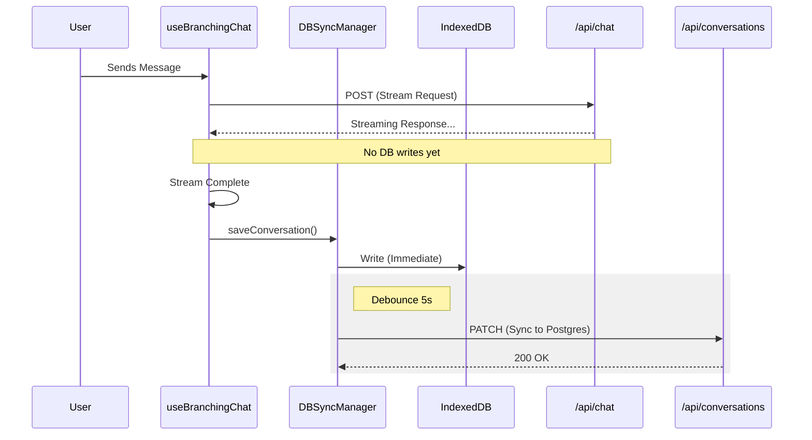

# JohnGPT Chat Persistence Architecture

## Overview

The chat persistence in JohnGPT follows a **Client-First, Optimistic** approach. Unlike traditional chat apps where the backend saves the message *before* responding, JohnGPT prioritizes responsiveness by saving locally first and syncing to the server in the background.

## The flow

1.  **User Types Message**: 
    - The client (`useBranchingChat`) sends the message to the inference endpoint (`/api/chat`).
    - The UI updates immediately with the user's message.

2.  **Streaming Response (Read-Only)**:
    - The `/api/chat` endpoint **DOES NOT** save the message to the database. 
    - It is a purely functional "inference engine" that processes the input, routes it to the correct AI model, and streams the text response back.
    - This ensures maximum speed and prevents database write-locks from blocking the stream.

3.  **Client-Side State Update**:
    - As the AI response streams in, the `useBranchingChat` hook updates its internal `messages` state.
    - A specialized `useEffect` hook monitors these changes.

4.  **Optimistic Local Save (IndexedDB)**:
    - When the message stream completes (status changes from `streaming` to `ready`), the `dbSyncManager` is triggered.
    - It **immediately** saves the full conversation tree to the browser's **IndexedDB**.
    - This ensures that if the user refreshes the page instantly, the chat is not lost, even if the server sync hasn't happened yet.

5.  **Background Server Sync**:
    - The `dbSyncManager` debounces the server sync (waits for 5 seconds of inactivity or completion).
    - It sends a `PATCH` request to `/api/conversations/[id]` with the full conversation data.
    - If the user is offline, the sync is queued and retried automatically when the connection is restored.

## Component Responsibility

### 1. `useBranchingChat.ts` (The Orchestrator)
- Manages the active chat state.
- Detects partial streams vs. completed messages.
- Calls `dbSyncManager.saveConversation()` only when safe (not during active streaming).
- Triggers AI Title Generation after 3 exchanges.

### 2. `DBSyncManager.ts` (The Variable Layer)
- **IndexedDB**: The primary "cache" that the user sees.
- **Debounce Logic**: Prevents spamming the API with a save request for every single token generated.
- **Sync Logic**: 
  - `isAuthenticated && !isWidget` -> Syncs to Postgres (`/api/conversations`).
  - `Offline` -> Queues for later.
  - `Guest` -> Local storage only.

### 3. `/api/chat/route.ts` (The Brain)
- **Stateless**.
- Performs Tier checks and Rate Limits.
- Streams the text.
- **Does NOT write to `Conversation` table.**

### 4. `/api/conversations/[id]/route.ts` (The Storage)
- Receives the `PATCH` request from the client.
- Updates the `messages` JSON column in Postgres.
- Handles `404` by creating a new record if it doesn't exist (Lazy Creation).

## Diagram

## Why this architecture?

1.  **Speed**: Typing and seeing the AI response feels instant because we don't wait for a DB `INSERT`.
2.  **Reliability**: Chat works offline. You can read past chats and even "send" messages (which queue up) without internet.
3.  **Cost**: We don't hammer the database with valid/invalid writes for every partial token. We only write the "final" state.
