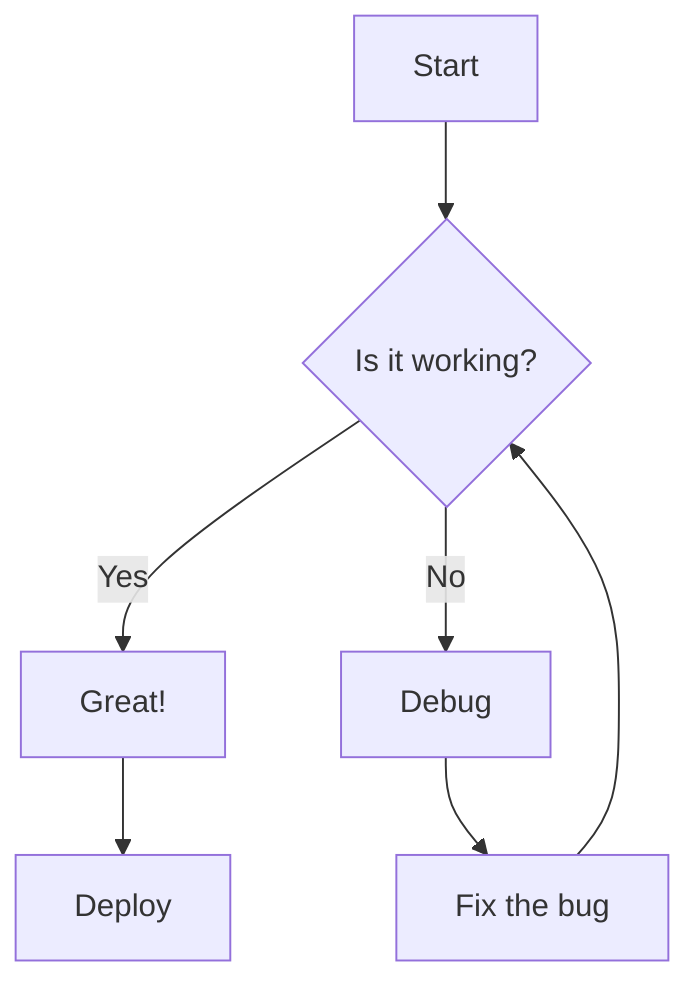
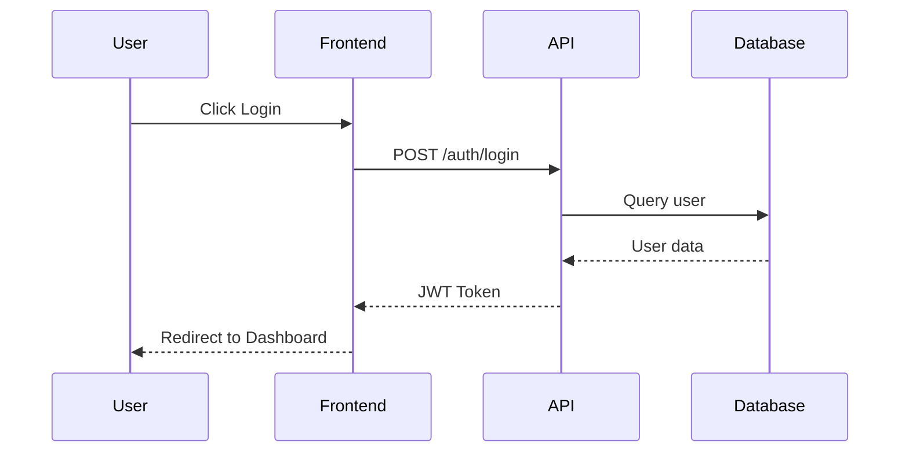

# 03 - Code Blocks & Syntax Highlighting

## Inline Code Variations

Simple: `console.log("hello")`

With special chars: `<div class="test">Hello</div>`

Empty backticks: ``

Single backtick inside: `` `backtick` ``

---

## Basic Fenced Code Block (No Language)

```
This is a plain code block
with no language specified.
It should display as monospace text.
```

---

## JavaScript / TypeScript

```javascript
// JavaScript example
const greeting = "Hello, World!";
const numbers = [1, 2, 3, 4, 5];

function fibonacci(n) {
  if (n <= 1) return n;
  return fibonacci(n - 1) + fibonacci(n - 2);
}

// Arrow function with destructuring
const processUser = ({ name, age, email }) => {
  console.log(`User: ${name}, Age: ${age}`);
  return { processed: true, timestamp: Date.now() };
};

// Async/await
async function fetchData(url) {
  try {
    const response = await fetch(url);
    const data = await response.json();
    return data;
  } catch (error) {
    console.error('Failed to fetch:', error);
    throw error;
  }
}

// Class with methods
class Calculator {
  constructor(initialValue = 0) {
    this.value = initialValue;
  }

  add(n) { this.value += n; return this; }
  subtract(n) { this.value -= n; return this; }
  multiply(n) { this.value *= n; return this; }
  getResult() { return this.value; }
}
```

```typescript
// TypeScript example
interface User {
  id: string;
  name: string;
  email: string;
  age?: number;
  roles: Role[];
}

type Role = 'admin' | 'user' | 'guest';

enum Status {
  Active = 'ACTIVE',
  Inactive = 'INACTIVE',
  Pending = 'PENDING',
}

const createUser = <T extends User>(userData: Partial<T>): T => {
  return {
    id: crypto.randomUUID(),
    roles: ['user'],
    ...userData,
  } as T;
};

// Generic function with constraints
function getProperty<T, K extends keyof T>(obj: T, key: K): T[K] {
  return obj[key];
}
```

---

## React / JSX

```jsx
import React, { useState, useEffect } from 'react';

const UserProfile = ({ userId }) => {
  const [user, setUser] = useState(null);
  const [loading, setLoading] = useState(true);

  useEffect(() => {
    fetchUser(userId).then(data => {
      setUser(data);
      setLoading(false);
    });
  }, [userId]);

  if (loading) return <div className="spinner">Loading...</div>;

  return (
    <div className="profile-card">
      
      <h2>{user.name}</h2>
      <p className="bio">{user.bio}</p>
      <button onClick={() => followUser(user.id)}>
        Follow
      </button>
    </div>
  );
};

export default UserProfile;
```

```tsx
// TypeScript React Component
interface ButtonProps {
  variant: 'primary' | 'secondary' | 'danger';
  size?: 'sm' | 'md' | 'lg';
  children: React.ReactNode;
  onClick?: () => void;
  disabled?: boolean;
}

export const Button: React.FC<ButtonProps> = ({
  variant,
  size = 'md',
  children,
  onClick,
  disabled = false,
}) => {
  return (
    <button
      className={`btn btn-${variant} btn-${size}`}
      onClick={onClick}
      disabled={disabled}
    >
      {children}
    </button>
  );
};
```

---

## Python

```python
# Python example
from typing import List, Optional, Dict, Any
import asyncio
from dataclasses import dataclass
from enum import Enum

class Status(Enum):
    PENDING = "pending"
    ACTIVE = "active"
    COMPLETED = "completed"

@dataclass
class Task:
    id: int
    title: str
    status: Status = Status.PENDING
    tags: List[str] = None

    def __post_init__(self):
        if self.tags is None:
            self.tags = []

def fibonacci(n: int) -> int:
    """Calculate fibonacci number recursively."""
    if n <= 1:
        return n
    return fibonacci(n - 1) + fibonacci(n - 2)

async def fetch_data(url: str) -> Dict[str, Any]:
    """Async function to fetch data."""
    async with aiohttp.ClientSession() as session:
        async with session.get(url) as response:
            return await response.json()

# List comprehension and lambda
squares = [x ** 2 for x in range(10) if x % 2 == 0]
sorted_items = sorted(items, key=lambda x: x['priority'])

# Context manager
with open('file.txt', 'r') as f:
    content = f.read()
```

---

## CSS / SCSS

```css
/* CSS example */
:root {
  --primary-color: #6366f1;
  --secondary-color: #8b5cf6;
  --background: #0f0f0f;
  --foreground: #ffffff;
  --border-radius: 8px;
  --shadow: 0 4px 6px -1px rgba(0, 0, 0, 0.1);
}

.card {
  background: var(--background);
  border-radius: var(--border-radius);
  padding: 1.5rem;
  box-shadow: var(--shadow);
  transition: transform 0.2s ease, box-shadow 0.2s ease;
}

.card:hover {
  transform: translateY(-4px);
  box-shadow: 0 10px 20px -5px rgba(0, 0, 0, 0.2);
}

/* Flexbox layout */
.container {
  display: flex;
  flex-wrap: wrap;
  gap: 1rem;
  justify-content: center;
  align-items: stretch;
}

/* Grid layout */
.grid {
  display: grid;
  grid-template-columns: repeat(auto-fit, minmax(300px, 1fr));
  gap: 2rem;
}

/* Animation */
@keyframes fadeIn {
  from { opacity: 0; transform: translateY(20px); }
  to { opacity: 1; transform: translateY(0); }
}

.animated {
  animation: fadeIn 0.5s ease-out forwards;
}

/* Media query */
@media (max-width: 768px) {
  .container {
    flex-direction: column;
  }
}
```

```scss
// SCSS example
$primary: #6366f1;
$spacing: 8px;

@mixin flex-center {
  display: flex;
  justify-content: center;
  align-items: center;
}

.button {
  @include flex-center;
  padding: $spacing * 2;
  background: $primary;

  &:hover {
    background: darken($primary, 10%);
  }

  &--large {
    padding: $spacing * 4;
    font-size: 1.25rem;
  }

  &__icon {
    margin-right: $spacing;
  }
}
```

---

## HTML

```html
<!DOCTYPE html>
<html lang="en">
<head>
  <meta charset="UTF-8">
  <meta name="viewport" content="width=device-width, initial-scale=1.0">
  <title>Example Page</title>
  <link rel="stylesheet" href="styles.css">
</head>
<body>
  <header class="header">
    <nav class="nav">
      <a href="/" class="logo">Brand</a>
      <ul class="nav-links">
        <li><a href="/about">About</a></li>
        <li><a href="/services">Services</a></li>
        <li><a href="/contact">Contact</a></li>
      </ul>
    </nav>
  </header>

  <main>
    <section id="hero" class="hero">
      <h1>Welcome to Our Site</h1>
      <p>Building amazing experiences.</p>
      <button type="button" onclick="handleClick()">
        Get Started
      </button>
    </section>

    <section id="features">
      <article class="feature-card">
        
        <h3>Feature One</h3>
        <p>Description of the first feature.</p>
      </article>
    </section>
  </main>

  <footer>
    <p>&copy; 2024 Company Name. All rights reserved.</p>
  </footer>
</body>
</html>
```

---

## JSON / YAML / TOML

```json
{
  "name": "my-project",
  "version": "1.0.0",
  "description": "A sample project",
  "main": "index.js",
  "scripts": {
    "dev": "next dev",
    "build": "next build",
    "start": "next start",
    "lint": "eslint . --fix"
  },
  "dependencies": {
    "react": "^18.2.0",
    "next": "^14.0.0"
  },
  "config": {
    "nested": {
      "deep": {
        "value": true
      }
    },
    "array": [1, 2, 3, "four", null, false]
  }
}
```

```yaml
# YAML example
name: CI/CD Pipeline
on:
  push:
    branches: [main, develop]
  pull_request:
    branches: [main]

jobs:
  build:
    runs-on: ubuntu-latest
    strategy:
      matrix:
        node-version: [16, 18, 20]
    
    steps:
      - uses: actions/checkout@v4
      - name: Setup Node.js
        uses: actions/setup-node@v4
        with:
          node-version: ${{ matrix.node-version }}
      
      - name: Install dependencies
        run: npm ci
      
      - name: Run tests
        run: npm test
        env:
          CI: true
          DATABASE_URL: ${{ secrets.DATABASE_URL }}
```

```toml
# TOML example
[package]
name = "my-rust-project"
version = "0.1.0"
edition = "2021"

[dependencies]
serde = { version = "1.0", features = ["derive"] }
tokio = { version = "1.0", features = ["full"] }

[dev-dependencies]
pretty_assertions = "1.4"

[[bin]]
name = "my-app"
path = "src/main.rs"
```

---

## Shell / Bash

```bash
#!/bin/bash

# Variables
PROJECT_NAME="my-app"
VERSION="1.0.0"

# Function
deploy() {
    echo "Deploying $PROJECT_NAME v$VERSION..."
    
    # Build the project
    npm run build
    
    # Docker operations
    docker build -t "$PROJECT_NAME:$VERSION" .
    docker push "$PROJECT_NAME:$VERSION"
    
    # Conditional
    if [ "$ENV" = "production" ]; then
        kubectl apply -f k8s/production/
    else
        kubectl apply -f k8s/staging/
    fi
}

# Loop
for file in *.log; do
    echo "Processing $file"
    gzip "$file"
done

# Array
SERVERS=("web1" "web2" "web3")
for server in "${SERVERS[@]}"; do
    ssh "$server" "sudo systemctl restart nginx"
done

# Run deployment
deploy
```

```powershell
# PowerShell example
$ProjectPath = "C:\Projects\MyApp"
$Version = "1.0.0"

function Deploy-Application {
    param(
        [string]$Environment = "staging"
    )
    
    Write-Host "Deploying to $Environment..." -ForegroundColor Cyan
    
    # Build
    npm run build
    
    # Copy files
    $destination = "\\server\deployments\$Environment"
    Copy-Item -Path "$ProjectPath\dist\*" -Destination $destination -Recurse
}

# Get all services
Get-Service | Where-Object { $_.Status -eq "Running" } | Select-Object Name, DisplayName
```

---

## SQL

```sql
-- SQL example
CREATE TABLE users (
    id SERIAL PRIMARY KEY,
    username VARCHAR(50) UNIQUE NOT NULL,
    email VARCHAR(100) UNIQUE NOT NULL,
    password_hash VARCHAR(255) NOT NULL,
    created_at TIMESTAMP DEFAULT CURRENT_TIMESTAMP,
    updated_at TIMESTAMP DEFAULT CURRENT_TIMESTAMP
);

-- Index for performance
CREATE INDEX idx_users_email ON users(email);

-- Insert data
INSERT INTO users (username, email, password_hash)
VALUES 
    ('john_doe', 'john@example.com', 'hash123'),
    ('jane_doe', 'jane@example.com', 'hash456');

-- Complex query with joins
SELECT 
    u.username,
    u.email,
    COUNT(o.id) AS total_orders,
    SUM(o.total) AS total_spent
FROM users u
LEFT JOIN orders o ON u.id = o.user_id
WHERE u.created_at > '2024-01-01'
GROUP BY u.id, u.username, u.email
HAVING COUNT(o.id) > 5
ORDER BY total_spent DESC
LIMIT 10;
```

---

## Rust

```rust
use std::collections::HashMap;
use serde::{Deserialize, Serialize};

#[derive(Debug, Clone, Serialize, Deserialize)]
struct User {
    id: u64,
    name: String,
    email: String,
    active: bool,
}

impl User {
    fn new(id: u64, name: &str, email: &str) -> Self {
        Self {
            id,
            name: name.to_string(),
            email: email.to_string(),
            active: true,
        }
    }
}

fn process_users(users: Vec<User>) -> HashMap<u64, User> {
    users.into_iter()
        .filter(|u| u.active)
        .map(|u| (u.id, u))
        .collect()
}

async fn fetch_data(url: &str) -> Result<String, reqwest::Error> {
    let response = reqwest::get(url).await?;
    let body = response.text().await?;
    Ok(body)
}

fn main() {
    let users = vec![
        User::new(1, "Alice", "alice@example.com"),
        User::new(2, "Bob", "bob@example.com"),
    ];
    
    let user_map = process_users(users);
    println!("{:?}", user_map);
}
```

---

## Go

```go
package main

import (
    "context"
    "encoding/json"
    "fmt"
    "log"
    "net/http"
    "time"
)

type User struct {
    ID        int64     `json:"id"`
    Name      string    `json:"name"`
    Email     string    `json:"email"`
    CreatedAt time.Time `json:"created_at"`
}

type UserService struct {
    users map[int64]*User
}

func NewUserService() *UserService {
    return &UserService{
        users: make(map[int64]*User),
    }
}

func (s *UserService) GetUser(ctx context.Context, id int64) (*User, error) {
    user, ok := s.users[id]
    if !ok {
        return nil, fmt.Errorf("user not found: %d", id)
    }
    return user, nil
}

func handleGetUser(w http.ResponseWriter, r *http.Request) {
    user := &User{ID: 1, Name: "John", Email: "john@example.com"}
    
    w.Header().Set("Content-Type", "application/json")
    json.NewEncoder(w).Encode(user)
}

func main() {
    http.HandleFunc("/user", handleGetUser)
    log.Fatal(http.ListenAndServe(":8080", nil))
}
```

---

## Diff

```diff
--- a/src/components/Button.tsx
+++ b/src/components/Button.tsx
@@ -1,5 +1,7 @@
 import React from 'react';
+import { cn } from '@/lib/utils';
 
-export const Button = ({ children }) => {
-  return <button className="btn">{children}</button>;
+export const Button = ({ children, variant = 'primary' }) => {
+  return (
+    <button className={cn('btn', `btn-${variant}`)}>
+      {children}
+    </button>
+  );
 };
```

---

## Mermaid Diagrams





---

## Code Block with Long Lines

```javascript
const veryLongVariableName = "This is a very long string that might cause horizontal scrolling or wrapping issues in the code block depending on how the renderer handles overflow and white-space settings";

const configurationObject = { projectName: "super-long-project-name-that-goes-on-and-on", version: "1.0.0", description: "An extremely detailed description that provides comprehensive information about what this configuration does and why it exists in the codebase" };
```

---

## Code with Line Numbers (if supported)

```javascript {1-5}
const a = 1;
const b = 2;
const c = 3;
const d = 4;
const e = 5;
```

---

## Empty Code Block

```

```

## Code Block with Only Whitespace

```
   
   
```
